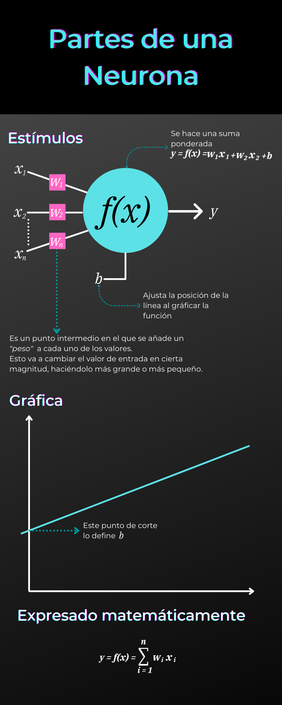
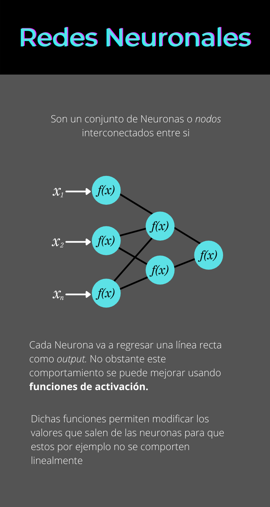
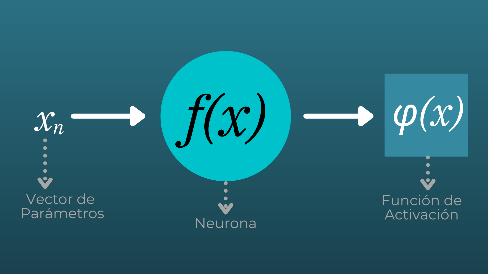
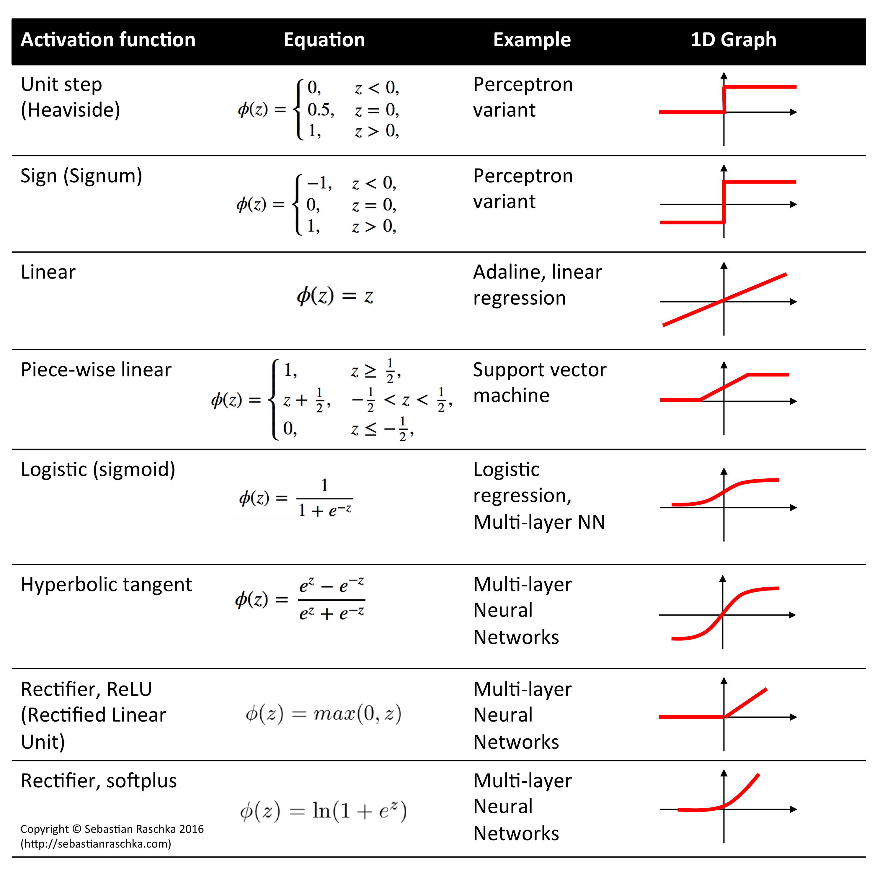
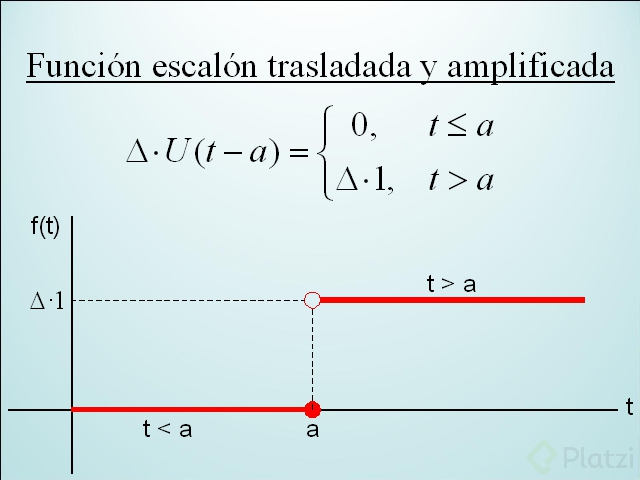
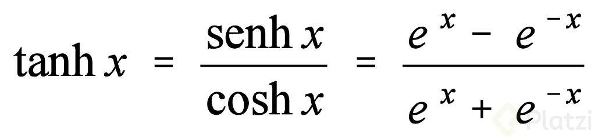
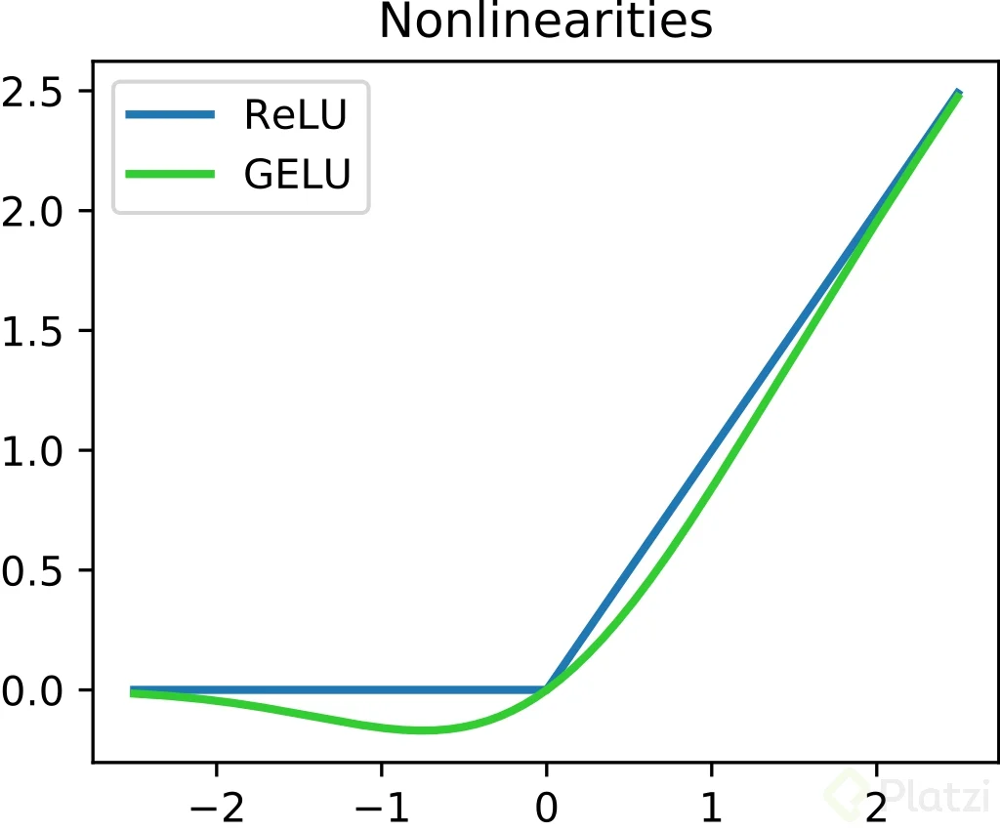

# platzi_calculo_basico_data_science

Curso de Matemáticas para Data Science: Cálculo Básico de Platzi https://platzi.com/cursos/calculo-data-science/

## Aprendamos sobre cálculo

las matemáticas son un lenguaje

En este curso trabajaremos el descenso del gradiente

## ¿Qué es el cálculo?

**Cálculo**
Realizar operaciones de una manera dada para llegar a un resultado

**Cálculo infinitesimal**
es calculo con numeros muy pequeños

**Cálculo diferencial**
Estudia la tasa de cambio de las funciones cuando esos cambios son muy pequeños (se aproxima a cero). Su principal herramienta es la derivada.

**Cálculo integral**
Estudia el proceso de integracion

## ¿Qué es una función?

**Una función**
es una **regla** en donde a cada elemento de un conjunto A se le **asigna** un elemento de un conjunto B.

Una funcion es como una maquina

Entra un elemento **x** y sale un elemento **y**
$ y = f(x) $

puede ser representado como una relacion de dos conjuntos
donde cada valor del conjunto **X** se le asigna un valor del conunto **Y** , y cada elemento del conjunto **X** se le asigna un unico elemento del conjunto **Y**.

### Formas de representar una funcion

#### Verbalmente

- "A cada letra del abecedario se le **asigna** un numero entero diferente"

- "El precio aumenta en 2 dolares por cada kilometro recorrido"

#### Numericamente

| $x$  | $f(x)$ |
| ---- | ------ |
| -14  | 4      |
| -6   | 2      |
| -2.5 | 0      |

#### Visualmente

#### Algebraicamente

$$ y  = f(x) = x^2 $$

## Dominio y rango de una función

**El Dominion de una función**
Los valores que toma **x** y estan definidos en la funcion $f(x)$

**El Rango de una funcion**
Todos los resultados que nos puede dar una función

### Ejemplificando con una cafetera**

- El **dominio** son los granos de cafe, no le podemos poner a la maquina harina ,talco o cualquier cosa que no sea cafe.

- la **funcion** es nuestra cafetera

- El **rango** son todas las clases de cafe que podemos preparar

## Cómo programar funciones algebraicas

https://colab.research.google.com/drive/17ys5APXdAYyiWcu9R4dUfL0Hv_bQ8jGc?usp=sharing#scrollTo=FflFWNqjJCuO

## Funciones trascendentes

Funciones que no son polinomicas como el seno, coseno o logaritmos

## Como Manipular Funciones

[Link Google Colab](https://colab.research.google.com/drive/1I4Gykoz2xCC5lPsSObkKQxAkFOYYZwmb?usp=sharing#scrollTo=MimQJFUozsWE)

## Funciones dentro de otras funciones

Conocidas las funciones f y g, la composicion de f y g esta dada por:

$$
f ∘ g = (f ∘ g)(x) = f(g(x))
$$

## Como se compone una neurona

las neuronas realizan un suma ponderada es decir recibe multiples parametros a los cuales a cada uno le asigna un peso para aumentar o reducir su valor y luego con esos valores de entrada realiza una funcion dando valores de salida.

Una neurona es una parte fundamental de una red neuronal. Básicamente es una forma fancy de referirse a una función.
Estas necesitan recibir estímulos al igual que ocurre con las neuronas biológicas. Dichos “estímulos” se usan para hacer una suma ponderada dentro de la función

Componentes de una Neurona:

[video explicativo de redes neuronales](https://www.youtube.com/watch?v=ysqpl6w6Wzg)

## Funciones de activación en una neurona

Fuciones de activación $\varphi(x)$

[Explicacion extra](https://stanford.edu/~shervine/teaching/cs-229/cheatsheet-deep-learning)

[video explicativo](https://www.youtube.com/watch?v=uwbHOpp9xkc)

Funciones de activación

Funcion Escalon

Formula de la tangente hiperbolica

Funcion de activación ReLU y GeLU

## Función de coste: calcula qué tan erradas son tus predicciones

los errores se elevan al cuadrado para que los errores pequeños se vuelvan aun mas pequeños y que los errores grandes aumenten en proporcion, es una forma en la cual matematicamente se castiga por el error a la funcion

Error cuadratico medio

$$
\mathrm{MSE} = \frac{1}{n} \sum_{i=1}^{n}(Y_{i}-\hat{Y}_{i})^2
$$

$
\mathrm{MSE} = mean squared error
$

$
{n} = number of data points
$

$
Y_{i} = observed values
$

$
\hat{Y}_{i} = predicted values
$

## ¿Qué es un límite?

Los limites son el valor al que tiende una funcion $f(x)$ cuando x se aproxima a un valor

$$
\lim_{x \to a} f(x) = L
$$

Se dice que el limite existe cuando el limite lateral derecho y el limite lateral izquierdo tienden al mismo valor

$$
\lim_{x \to a^+} f(x) = L
$$

$$
\lim_{x \to a^-} f(x) = L
$$

Una parte importante de los limites es que de ahí proviene uno de los conceptos más importante y poderoso del calculo, la derivada. La derivada no es más que el resultado de un límite que representa la pendiente de la recta tangente (un cambio de la variable dependiente con respecto ala dependiente ) a la gráfica de la función en un punto.

Definicion de una derivada

$$
f'(x) = \lim_{h \to 0}\frac{f(x+h) - f(x)}{h}
$$

[video de explicacion de limites](https://www.youtube.com/watch?v=o2UTk8bsLS0)

Reto:

El límite de 1/x cuando x tiende a 0 por la ⬅ es -∞.
El límite de 1/x cuando x tiende a 0 por la ➡ es +∞.
.
Conclusión: La aproximación a 0 de cada lado llevan a diferentes valores… Por lo tanto el límite no existe.

## ¿De dónde surge la derivada?

Definicion de una derivada

$$
f'(x) = \lim_{h \to 0}\frac{f(x+h) - f(x)}{h}
$$
