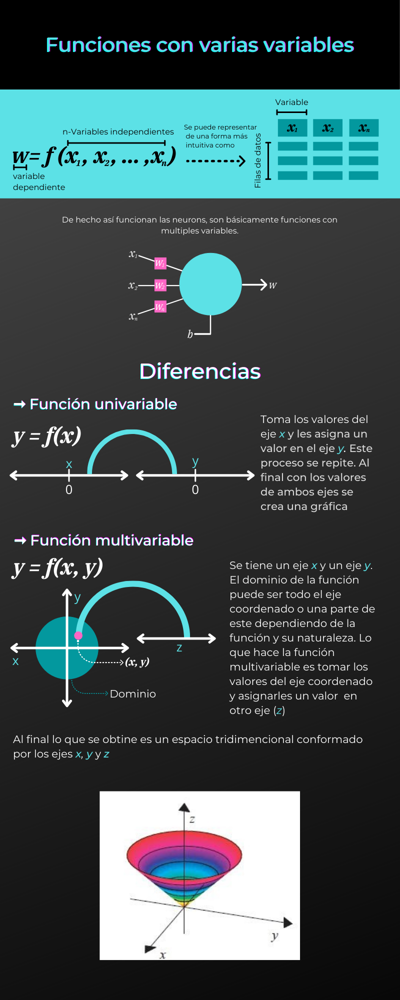
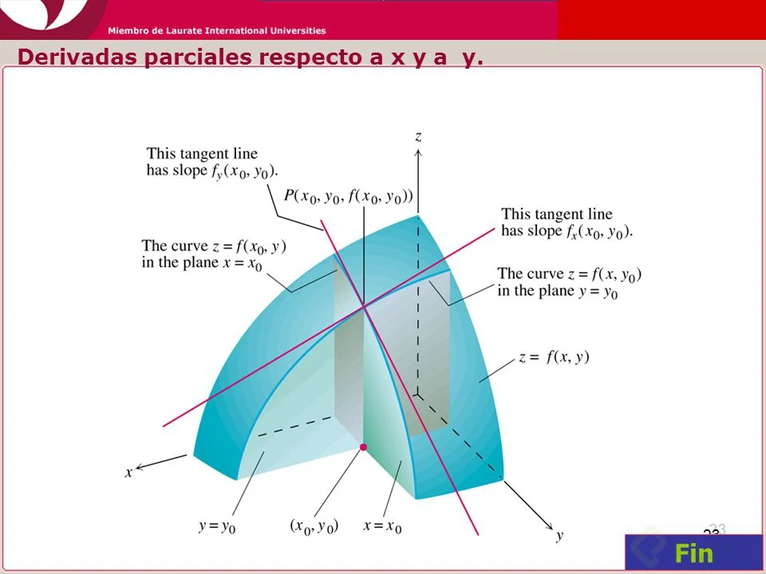
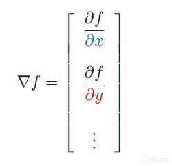
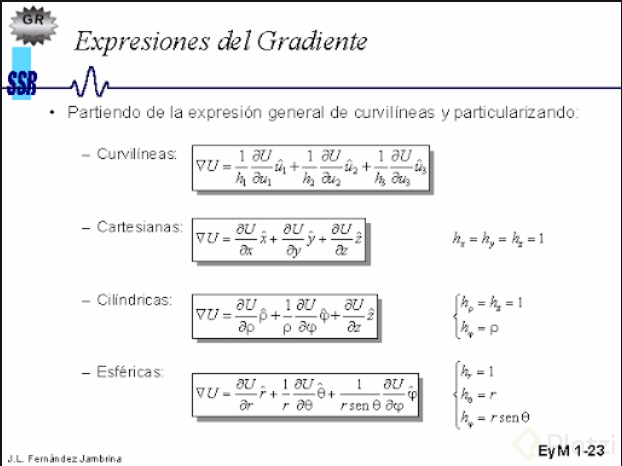

# platzi_calculo_basico_data_science

Curso de Matemáticas para Data Science: Cálculo Básico de Platzi https://platzi.com/cursos/calculo-data-science/

## Aprendamos sobre cálculo

las matemáticas son un lenguaje

En este curso trabajaremos el descenso del gradiente

## ¿Qué es el cálculo?

**Cálculo**
Realizar operaciones de una manera dada para llegar a un resultado

**Cálculo infinitesimal**
es calculo con numeros muy pequeños

**Cálculo diferencial**
Estudia la tasa de cambio de las funciones cuando esos cambios son muy pequeños (se aproxima a cero). Su principal herramienta es la derivada.

**Cálculo integral**
Estudia el proceso de integracion

## ¿Qué es una función?

**Una función**
es una **regla** en donde a cada elemento de un conjunto A se le **asigna** un elemento de un conjunto B.

Una funcion es como una maquina

Entra un elemento **x** y sale un elemento **y**
$ y = f(x) $

puede ser representado como una relacion de dos conjuntos
donde cada valor del conjunto **X** se le asigna un valor del conunto **Y** , y cada elemento del conjunto **X** se le asigna un unico elemento del conjunto **Y**.

### Formas de representar una funcion

#### Verbalmente

- "A cada letra del abecedario se le **asigna** un numero entero diferente"

- "El precio aumenta en 2 dolares por cada kilometro recorrido"

#### Numericamente

| $x$  | $f(x)$ |
| ---- | ------ |
| -14  | 4      |
| -6   | 2      |
| -2.5 | 0      |

#### Visualmente

#### Algebraicamente

$$ y  = f(x) = x^2 $$

## Dominio y rango de una función

**El Dominion de una función**
Los valores que toma **x** y estan definidos en la funcion $f(x)$

**El Rango de una funcion**
Todos los resultados que nos puede dar una función

### Ejemplificando con una cafetera**

- El **dominio** son los granos de cafe, no le podemos poner a la maquina harina ,talco o cualquier cosa que no sea cafe.

- la **funcion** es nuestra cafetera

- El **rango** son todas las clases de cafe que podemos preparar

## Cómo programar funciones algebraicas

https://colab.research.google.com/drive/17ys5APXdAYyiWcu9R4dUfL0Hv_bQ8jGc?usp=sharing#scrollTo=FflFWNqjJCuO

## Funciones trascendentes

Funciones que no son polinomicas como el seno, coseno o logaritmos

## Como Manipular Funciones

[Link Google Colab](https://colab.research.google.com/drive/1I4Gykoz2xCC5lPsSObkKQxAkFOYYZwmb?usp=sharing#scrollTo=MimQJFUozsWE)

## Funciones dentro de otras funciones

Conocidas las funciones f y g, la composicion de f y g esta dada por:

$$
f ∘ g = (f ∘ g)(x) = f(g(x))
$$

## Como se compone una neurona

las neuronas realizan un suma ponderada es decir recibe multiples parametros a los cuales a cada uno le asigna un peso para aumentar o reducir su valor y luego con esos valores de entrada realiza una funcion dando valores de salida.

Una neurona es una parte fundamental de una red neuronal. Básicamente es una forma fancy de referirse a una función.
Estas necesitan recibir estímulos al igual que ocurre con las neuronas biológicas. Dichos “estímulos” se usan para hacer una suma ponderada dentro de la función

Componentes de una Neurona:

[video explicativo de redes neuronales](https://www.youtube.com/watch?v=ysqpl6w6Wzg)

## Funciones de activación en una neurona

Fuciones de activación $\varphi(x)$

[Explicacion extra](https://stanford.edu/~shervine/teaching/cs-229/cheatsheet-deep-learning)

[video explicativo](https://www.youtube.com/watch?v=uwbHOpp9xkc)

Funciones de activación

Funcion Escalon

Formula de la tangente hiperbolica

Funcion de activación ReLU y GeLU

## Función de coste: calcula qué tan erradas son tus predicciones

los errores se elevan al cuadrado para que los errores pequeños se vuelvan aun mas pequeños y que los errores grandes aumenten en proporcion, es una forma en la cual matematicamente se castiga por el error a la funcion

Error cuadratico medio

$$
\mathrm{MSE} = \frac{1}{n} \sum_{i=1}^{n}(Y_{i}-\hat{Y}_{i})^2
$$

$
\mathrm{MSE} = mean squared error
$

$
{n} = number of data points
$

$
Y_{i} = observed values
$

$
\hat{Y}_{i} = predicted values
$

## ¿Qué es un límite?

Los limites son el valor al que tiende una funcion $f(x)$ cuando x se aproxima a un valor

$$
\lim_{x \to a} f(x) = L
$$

Se dice que el limite existe cuando el limite lateral derecho y el limite lateral izquierdo tienden al mismo valor

$$
\lim_{x \to a^+} f(x) = L
$$

$$
\lim_{x \to a^-} f(x) = L
$$

Una parte importante de los limites es que de ahí proviene uno de los conceptos más importante y poderoso del calculo, la derivada. La derivada no es más que el resultado de un límite que representa la pendiente de la recta tangente (un cambio de la variable dependiente con respecto ala dependiente ) a la gráfica de la función en un punto.

Definicion de una derivada

$$
f'(x) = \lim_{h \to 0}\frac{f(x+h) - f(x)}{h}
$$

[video de explicacion de limites](https://www.youtube.com/watch?v=o2UTk8bsLS0)

Reto:

El límite de 1/x cuando x tiende a 0 por la ⬅ es -∞.
El límite de 1/x cuando x tiende a 0 por la ➡ es +∞.
.
Conclusión: La aproximación a 0 de cada lado llevan a diferentes valores… Por lo tanto el límite no existe.

## ¿De dónde surge la derivada?

La derivada es una recta tangente a un punto de una funcion

La tangente de una curva es una recta adyacente a un punto (la linea recta toca un punto de la recta)

para encontrar la recta tangente correcta se toman dos puntos de la recta en los cuales la distancia entre esos dos puntos tienda a cero
dando como resultado la derivada por definicion

Siendo asi la derivada la recta que es tangente a un punto dado de una funcion

Definicion de una derivada:

$$
m = \frac{y_2 - y_1}{x_2 - x_1}
$$

tomando que la distancia entre los puntos es $\Delta x = h$

$$
m = \frac{f(x + h) - f(x)}{x + h - x} = \frac{f(x + h) - f(x)}{h}
$$

$$
\lim_{h \to 0}\frac{f(x+h) - f(x)}{h}
$$

$$
f'(x) = \lim_{h \to 0}\frac{f(x+h) - f(x)}{h}
$$

### Notas extras de *Autor: Ing. Financiero Mauricio Obe, Auxiliar de Catedra de calculo durante 4 años en la universidad UAGRM, Santa Cruz, Bolivia.*

Entender las derivadas es sublime, es una delicia, pero si no le entiendes o alquien no te lo explica bien y el ¿por que? entonces sera muy confunsa, aqui te dejo una explicacion por medio de formulas, espero logres saborearla igual que yo y disfrutemos de las matematicas:
Primero: Ubica la tangente, la tangente es un angulo

Empecemos con la tangente, si entiendes la tangente, lo entenderas todo. (observa bien la imagen y ubica la tangente)

la tangente es un angulo que se obtiene al dividir el cateto opuesto y el cateto adyacente, si solo vemos el angulo y no el triangulo la imagen quedaria asi:

pero fijate en su formula:

Que tal si ahora esa formula lo llevamos a geometria analitica, veamos:

muy parecido a la trigonometria cierto, si en caso conocemos todos los puntos podriamos usar la formula de pendiente que es la misma que tangente, observa:

Ves que Tangente es igual a pendiente, hasta ahi todo facil y entendible, pero en calculo no conocemos los puntos de cordenadas en el eje cartesiano, tendriamos que graficar la funcion miles, millones de veces para saber su tangente o pendiente en cada punto por lo tanto es inviable, pero puede ser usado para otras cosas tambien, en economia por ejemplo se usa bastante.
¿Como podemos calcular la tangente o pendiente de una funcion?
Con limites , veamos:
Recuerda que ya sabes la formula de tangente, ya sabes la formula de pendiente por lo tanto ya puedes entender la formula de tangente o pendiente de una funcion por definicion, es decir, por limites.

Una vez entendida la formula podemos imaginar esta maravilla de derivadas de forma grafica, observa, ¿Si o no que es sublime, deliciosa, exquisita?

## Notación de la derivada

Existen diferentes formas de expresar la derivada si de notaciones hablamos.

$$
f'(x) = y' = \frac{dy}{dx} = \frac{df}{dx} = \frac{d}{dx}f(x) = Df(x) = D_xf(x)
$$

### Notación de Leibniz

Primera derivada

$$
\frac{d^2y}{dx^2}
$$

Enesima derivada

$$
\frac{d^ny}{dx^n}
$$

Esta notación nos sirve para entender como la derivada puede ser expresada como los incrementos tanto de x como de y cuando el incremento de x tiende a cero.

$$
\frac{dy}{dx}=\lim_{\Delta x \to 0}\frac{\Delta y}{\Delta x}
$$

### Notación de Lagrange

Primera derivada

$$
f'(x)
$$

Segunda derivada

$$
f''(x)
$$

Enesima derivada

$$
f^n(x)
$$

## Empecemos a derivar

### Operaciones

Suma

$$
(f + g)'(x) = f'(x) + g'(x)
$$

Producto

$$
(f * g)'(x) = f'(x)*g(x) + f(x)*g'(x)
$$

Cociente

$$
(\frac{f(x)}{g(x)})' = \frac{f'(x)g(x) - f(x)g'(x)}{g(x)^2}
$$

Regla de la cadena

$$
(f \circ g)'(x) = f'(g(x)) * g'(x)
$$

nos permite calcular derivadas de funciones compuestas ejemplo

$sin(x²)$ es una función compuesta porque puede construirse como $f(g(x))$ para $f(x)=sin(x)$ y $g(x)=x²$

## Máximos y mínimos: subidas y bajadas en una montaña rusa

### Teorema de la Primera Derivada

- Si f’(x)>0 hacia la izquierda de un punto a y si f’(x)<0 hacia la derecha del punto a, entonces f tiene un máximo relativo en (a, f(a))
- Si f’(x)<0 hacia la izquierda de un punto a y si f’(x)>0 hacia la derecha del punto a, entonces f tiene un mínino relativo en (a, f(a))
- Si f’(x) es menos o mayor de ambos lados, no es ni un máximo ni un mínimo

### Teorema de la Segunda Derivada

- Si f’’(x)<0 entonces f tiene un máximo relativo en (x, f(x))
- Si f’’(x)>0 entonces f tiene un mínimo relativo en (x, f(x))
- Si f’’(x)=0 no se puede determinar si es un máximo o un mínimo o ninguno de los dos. Se debe utilizar el teorema de la primera derivada para poder determinarlo

[Video explicativo](https://youtu.be/yVWvNE5G6_Y)

## ¿Cómo optimizar una función?

Ejemplo mayor area posible para construir un rectangulo con 3 muros que sumen 50 metros en total y el cuarto muro sera un muro natural

Son 50 metros de perimetro de los 3 muros que construiremos y el 4 muro es un muro natural (ocupara todo el tamaño que sea necesario)

Formula de area de un rectangulo, el area es igual a lado por lado

$$
A = x * y
$$

En el ejercicio es dado que $ x + y + x = 50$, $ 2x + y = 50$

$ y = 50 - 2x $

$ A = x * (50 -2x) = 50x -2x^2 $

$A(x) = 50x -2x^2 $

para obtener el valor maximo derivamos

$$
A'(x) = 50 - 4x
$$

$$
A'(x) = 50 - 4x = 0
$$

$$
x = \frac{-50}{-4} = \frac{25}{2} = 12.5
$$

$$
A'[x = 12.45] = 50 - 4(12.45) = \frac{1}{5}
$$

$$
A'[x = 12.55] = 50 - 4(12.55) = -\frac{1}{5}
$$

Ya que a la izquierda del valor obtenido al igualar la derivada a cero hay una pendiente positiva, y a la derecha del valor hay una pendiente negativa, podemos asegurar que ese valor es un punto maximo en la funcion

$$
y = 50 - 2 (12.5) = 25
$$

Calculo final de el area

$$
A = 25 * 12.5 = 312.5 m^2
$$

### Notas extras

Saber optimizar es muy importante, y a mi entender, lo más difícil es lograr ser capaz de tener el razonamiento acertado de representar algebraicamente las variables de el problema real que estamos buscando optimizar.
Después es algo más mecánico, derivar y hallar máximos o mínimos y reemplazar para encontrar la solución al problema planteado, pero lo fundamental es el razonamiento para representar acertadamente esos factores de la vida real en variables.
Este problema es muy sencillo, son solo 3 lados, pero a veces tienen muchas más dimensiones y lados a tener en cuenta (cómo optimizar un cubo), por lo que yo les recomendaría practicar con problemas de optimización hasta tener aceitado este razonamiento.
Acá les dejo un link de una página web dónde hay varios problemas para hacer con su solución, por si les interesa:
https://www.matesfacil.com/BAC/optimizar/problemas-resueltos-optimizar-extremos-maximo-minimo-derivada-creciente-decreciente-monotonia.html

## Más dimensiones para tus funciones

funciones de varias variables o multivariables

$$
w = f(x_1, x_2, ..., x_n)
$$

$$
z = f(x,y)
$$

### Notas alumnos

Les comparto mis apuntes de esta clase, espero que les sean de utilidad.

Clase 21. Más dimensiones para tus funciones
A lo largo del curso se ha trabajado con funciones que sólo reciben una sola variable por parámetro (univariable). No obstante las funciones pueden tener más de una variable.

Sin importar las variables que tenga la función, al final siempre va a salir un resultado.

Pueden ver la imagen en tamaño original en este [enlace](https://i.ibb.co/nLVL07T/funciones-multivariable.png)

## Diseñando mapas: curvas de nivel

Si alguien tiene la duda de que es la función meshgrid, les dejo una página que me ayudó . [Página](https://interactivechaos.com/es/manual/tutorial-de-numpy/la-funcion-meshgrid)

[Mapas de colores de matplotlib](https://matplotlib.org/stable/tutorials/colors/colormaps.html)

## Derivadas parciales

Las derivadas parciales se utilizan a la hora de derivar una funcion con multiples variables

[Video explicativo](https://youtu.be/RaR2g-h-WoI)

$$
z = f(x,y)
$$

derivada parcial respecto a X

$$
\frac{\partial f}{\partial x}_{x_0,y_0} =\lim_{h \to 0}\frac{f(x_0+h,y_0) - f(x_0,y_0))}{h}
$$

derivada parcial respecto a Y

$$
\frac{\partial f}{\partial y}_{x_0,y_0} =\lim_{h \to 0}\frac{f(x_0,y_0+h) - f(x_0,y_0))}{h}
$$

### Notas extras

Se debe tener imaginacion, pero cuando tenemos ambas derivadas y lo igualamos a cero podemos encontrar puntos maximos y minimos:

- dz/dx = 0
- dz/dy = 0
resolver el sistema de ecuaciones = punto max, punto min, [Punto Silla](https://es.wikipedia.org/wiki/Punto_de_silla)

## Ejemplos de derivadas parciales

Ejemplo 1:
$$
f(x, y) = 4x^3 +6x^2y^6 + 5y + 3
$$

$$
\frac{\partial f}{\partial x} = 12x^2 + 12xy^6 + 0 + 0 = 12x^2 + 12xy^6
$$

$$
\frac{\partial f}{\partial y} = 0 + 36x^2y^5 + 5 + 0 = 36x^2y^5 + 5
$$

Ejemplo 2:

$$
f(x,y) = y \sin(xy)
$$

Regla del producto
$$
\frac{\partial f}{\partial y} = f(y)g'(y) + g(y)f'(y)
$$

$f(y) = y$

$f'(y)=1$

$g(y) = \sin(xy)$

$g'(y) = \cos(xy) * x = x\cos(xy)$

$\frac{\partial}{\partial y}\sin(y)=\cos(y)$

$\frac{\partial}{\partial y}xy=x$

$$
\frac{\partial f}{\partial y} = yx\cos(xy) + \sin(xy)
$$

### Notas extras

Dato Matemático:

- El conjunto de primeras derivadas parciales se le conoce como Gradiente.
- La Matriz de segundas derivadas parciales se le comoce como Hessiana.
- El determinante de la matriz Hessiana se le conoce como Jacobiano
- El Jacobiano es útil cuando queremos hacer transformaciones. Por ejemplo: Pasar del plano cartesiano a coordenadas polares.

## Regla de la cadena y su utilidad en cálculo multivariable

[lectura en platzi](https://platzi.com/clases/2155-calculo-data-science/35914-regla-de-la-cadena-y-su-utilidad-en-calculo-multiv/)

[Video explicativo](https://www.youtube.com/watch?v=DFn9wUEBnbU)

## Subamos con el gradiente

El gradiente se expresa como:

$$
\nabla f = \frac{\partial f}{\partial x}\hat{i} + \frac{\partial f}{\partial y}\hat{j}
$$

Ejemplo

$$
f(x, y) = 100 - x^2 - y^2
$$

$$
\frac{\partial f}{\partial x} = -2x
$$

$$
\frac{\partial f}{\partial y} = -2y
$$

$$
\nabla f = -2x\hat{i} - 2y\hat{j}
$$

### Notas Extras

El gradiente almacena toda la información de la derivadas parciales de una función multivariable. Pero es más que un simple dispositivo de almacenamiento, tiene muchas aplicaciones en muchas área de las ciencias.
El gradiente es una función escalar multivariable que empaqueta toda la información de sus derivadas parciales en un vector.

Cabe resaltar el la forma del gradiente varia dependiendo las coordenadas que utilicemos, tiene las misma interpretación, pero se utiliza se escribe de destina manera.

## ¿Qué es el descenso del gradiente?

[DotCSV QUe es el descenso del gradiente](https://www.youtube.com/watch?v=A6FiCDoz8_4)

$$
f(x, y) = x^2 + y^2
$$

$$
w: w - \nabla f
$$

$$
w: w - \alpha\nabla f
$$

donde $\alpha$ es el learning rate
